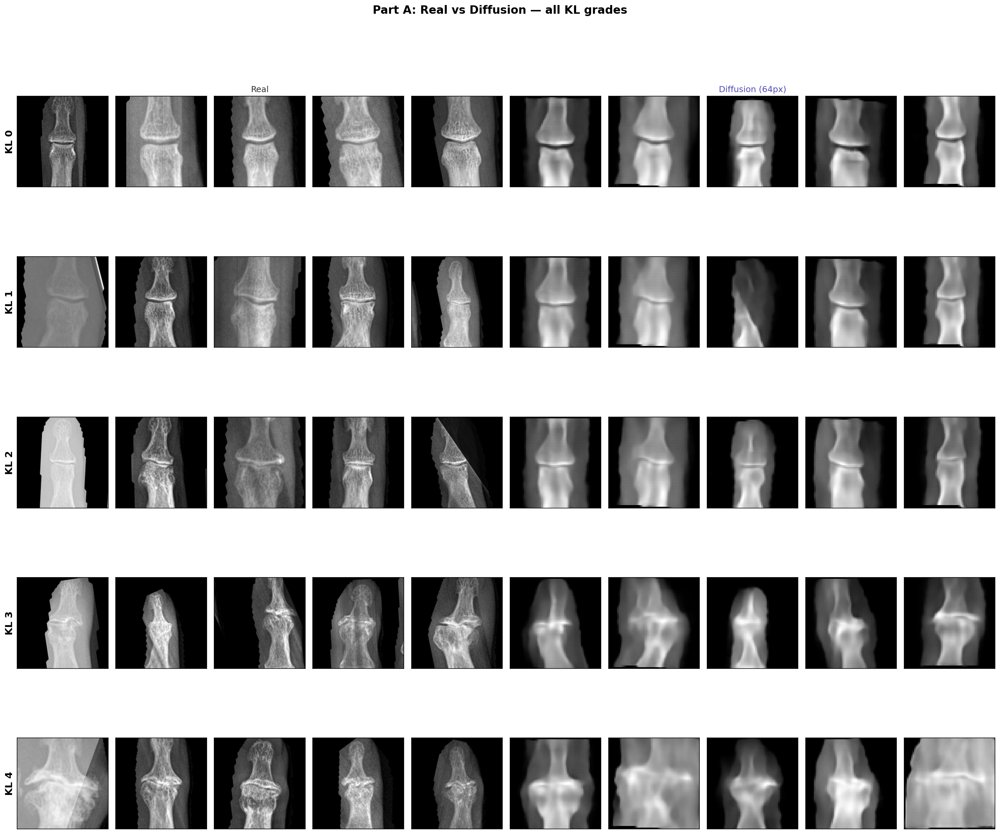
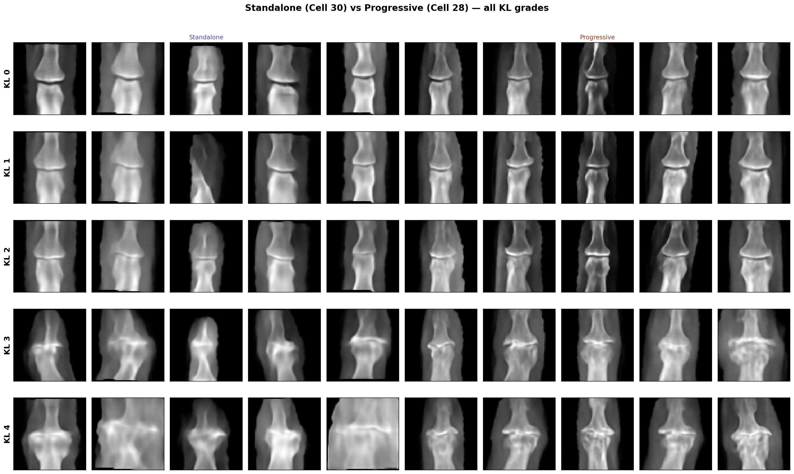
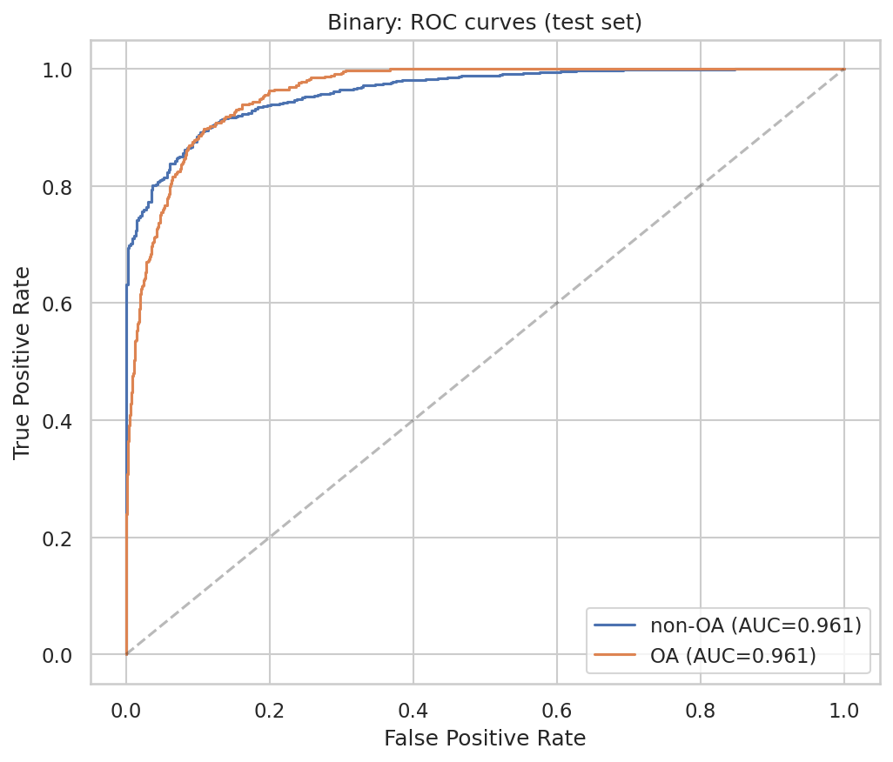
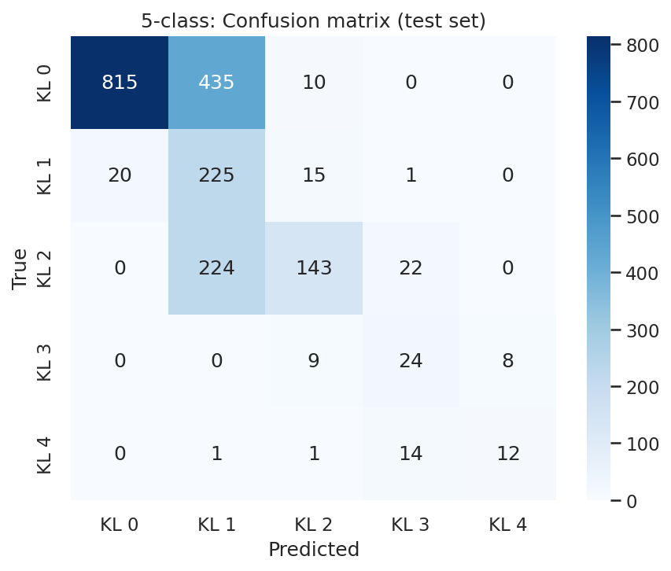

# Generative AI for Hand Osteoarthritis — X-ray Synthesis

My group's final project for **MET CS 790 (Advanced Computer Vision)** at Boston University, done in collaboration with Tufts Medical Center.

## The problem

Severe hand osteoarthritis is rare in our data. Across all the joint X-rays, KL grades 3 and 4 together are only about 2.5% of cases. That scarcity is a real problem: a model trained to grade severity barely ever sees a severe example, so it does worst exactly where it matters most. Our idea was to generate realistic synthetic X-rays of diseased joints to fill that gap, conditioning the generator on the severity grade we want.

We judged it two ways: whether the generated images look real (FID), and whether adding them actually helps a downstream severity classifier.

## My part

This was a three-person project. I built the diffusion side — a KL-grade-conditioned **Latent Diffusion Model** (a VAE plus a U-Net denoiser that takes the KL grade as a condition, with a DDPM schedule) that generates DIP joint X-rays at 64x64 and 180x180, aimed at the rare KL 3 and KL 4 grades. My teammates built the CycleGAN baseline and the shared evaluation framework.

The most interesting result came from generating severity *progressively* — starting from a healthy joint and worsening it step by step (KL 0 to 2 to 3 to 4) instead of generating each grade from scratch.

## Results

Diffusion-generated joint X-rays by KL grade:



Progressive generation produced more realistic and more recognizable severe cases than generating each grade on its own:

| KL 4 (most severe) | Standalone | Progressive |
|---|---|---|
| FID (lower is better) | 187.7 | 114.0 |
| Classifier recognizes the grade | 37% | 80% |



For reference, a ResNet-18 trained on the real DIP X-rays (patient-level split, averaged over 3 seeds) reached 0.96 AUC for OA detection and 0.88 for 5-class KL grading:




## The pipeline

The notebooks run in order, Step 0 through Step 6:

| Step | Notebook | What it does |
|---|---|---|
| 0 | Prelim_Data_Analysis | dataset analysis and disease-stage visualization |
| 1 | data_prep | raw data into cleaned, patient-level split manifests |
| 2 | cyclegan | CycleGAN baseline |
| 3 | LDM_64 | conditional Latent Diffusion at 64x64 |
| 4 | LDM_180 | conditional Latent Diffusion at 180x180 |
| 5 | Eval_Framework | baseline ResNet-18 classifier |
| 6 | Final_Eval | FID, downstream evaluation, and ablations |

## Running it

```bash
pip install -r requirements.txt
```

The notebooks were written in Google Colab on a Tesla T4. Each one mounts Google Drive and reads from a `CV-Project/` folder, so set the path near the top:

```python
PROJECT_ROOT = '/content/drive/MyDrive/CV-Project'
```

## A note on the data

The raw images (~686 MB), the clinical spreadsheet, and the model checkpoints (~254 MB each) aren't in the repo — they're large, and the clinical data is private. The `.gitignore` keeps them out. The `docs/` folder has the report, proposal, poster, and slides.
