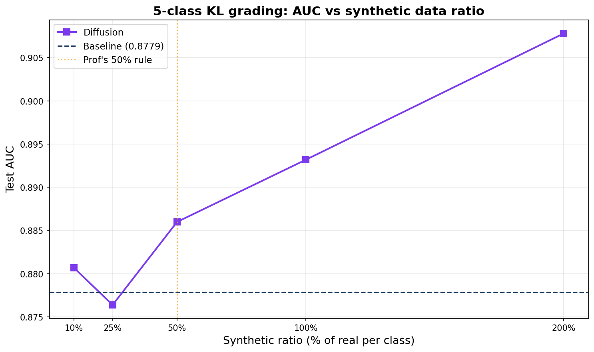

# Generative AI for Hand Osteoarthritis Disease Simulation

Synthesizing realistic hand X-rays across osteoarthritis severity to fix a hard class-imbalance problem in medical imaging.

**MET CS 790: Advanced Computer Vision · Boston University** (in collaboration with Tufts Medical Center)
**Team:** Zulal Akarsu (lead) · Jai Sharma · Maria Martin · **Track 3, Group 3**

---

## TL;DR

Severe hand-osteoarthritis (OA) cases are rare — KL grades 3–4 are only ~2.5% of joint observations — which starves any classifier of severe examples. We train generative models to **synthesize realistic diseased joint X-rays conditioned on severity (KL grade)** and test whether that synthetic data improves a downstream severity classifier.

- **Baseline classifier (real data only):** ResNet-18 reaches **AUC 0.960 ± 0.001** for OA detection (binary) and **0.878 ± 0.015** for 5-class KL grading.
- **Two generators compared:** a CycleGAN baseline and a KL-conditioned **Latent Diffusion Model (LDM)** at 64×64 and 180×180.
- **Headline finding:** generating severity **progressively** (KL 0→2→3→4) beats generating each grade standalone — FID for severe KL4 drops from **187.7 → 114.0**, and a held-out classifier recognizes synthetic **KL4** images **37% → 80%** of the time.

## Team & contributions

A three-person project for MET CS 790. Responsibilities split across the pipeline:

- **Maria Martin** — Designed and implemented the **conditional Latent Diffusion Model** (VAE encoder/decoder, KL-grade-conditioned U-Net denoiser, DDPM noise schedule) to synthesize DIP joint X-rays at 64×64 and 180×180, targeting the rare KL 3–4 severity classes — including the **progressive generation** scheme that produced this project's headline result (notebooks `G3_Step3_LDM_64` and `G3_Step4_LDM_180`).
- **Jai Sharma** — Data preprocessing pipeline and the CycleGAN baseline (`G3_Step1`, `G3_Step2`).
- **Zulal Akarsu** (team lead) — Preliminary data analysis, the evaluation framework, and final evaluation/ablations (`G3_Step0`, `G3_Step5`, `G3_Step6`).

## Results

### Generated samples (conditional Latent Diffusion)


### Progressive vs. standalone generation
Generating each severity level by progressively worsening a healthy joint produces more realistic and more recognizable severe cases than generating each grade from scratch.


| Metric (KL 4, severe) | Standalone | Progressive |
|---|---|---|
| FID (lower = better) | 187.7 | **114.0** |
| Classifier recognizes grade | 37.0% | **80.3%** |

| FID by KL grade | 0 | 1 | 2 | 3 | 4 |
|---|---|---|---|---|---|
| Standalone  | 162.8 | 163.5 | 171.1 | 183.4 | 187.7 |
| Progressive | **121.4** | **122.5** | **131.3** | **116.4** | **114.0** |

### Downstream classifier — baseline on real data
ResNet-18, patient-level split, 3 seeds (mean ± std).

| Task | Test AUC |
|---|---|
| Binary (OA vs. non-OA) | **0.960 ± 0.001** |
| 5-class KL grading | **0.878 ± 0.015** |


### Synthetic-augmentation ablation
Retraining the classifier with varying synthetic:real ratios, comparing CycleGAN vs. diffusion sources.



> Full metrics are in [`results/metrics/`](results/metrics).

## Dataset

A private Hand Osteoarthritis collection developed with Tufts Medical Center (**not included** in this repo).

- 3,590 patients; hand X-rays at two timepoints (v00 baseline, v06 six-year)
- 41,061 pre-extracted joint ROI images (median 180×180 px)
- 12 joints/hand (DIP 2–5, PIP 2–5, MCP 2–5); modeling subset = DIP joints (~14K), which carry most disease signal
- Clinical scores: KL, JSN, OP, ER (+ PW, ME, CY)
- KL distribution is heavily right-skewed (~74% KL 0; KL 3+4 ≈ 2.5%) — the imbalance this project targets

## Approach

1. **CycleGAN (baseline)** — unpaired translation between healthy (KL 0–1) and osteoarthritic (KL 2+) DIP joints.
2. **Conditional Latent Diffusion (LDM)** — KL-grade-conditioned denoising in VAE latent space, trained at 64×64 and 180×180, targeting rare KL 3/4. Includes the progressive-generation scheme above.
3. **Evaluation** — FID for image quality; a held-out classifier "sanity" check on whether synthetic images read as their intended grade; and a downstream ResNet-18 retrained with synthetic augmentation to measure AUC effects, plus CycleGAN-vs-diffusion ablations.

## Repository structure

```
.
├── README.md
├── requirements.txt
├── .gitignore
├── notebooks/                       # pipeline, Step 0 → Step 6
│   ├── G3_Step0_Prelim_Data_Analysis.ipynb
│   ├── G3_Step1_data_prep.ipynb
│   ├── G3_Step2_cyclegan.ipynb
│   ├── G3_Step3_LDM_64.ipynb
│   ├── G3_Step4_LDM_180.ipynb
│   ├── G3_Step5_Eval_Framework.ipynb
│   └── G3_Step6_Final_Eval.ipynb
├── results/                         # curated figures + metric JSONs
│   └── metrics/
└── docs/                            # report, proposal, poster, slides
```

Large/private artifacts (raw images, `hand.xlsx`, split manifests, `.pth` checkpoints) are excluded via `.gitignore`.

## Pipeline (notebook by notebook)

| Step | Notebook | What it does |
|------|----------|--------------|
| 0 | `G3_Step0_Prelim_Data_Analysis` | Dataset analysis + disease-stage visualization |
| 1 | `G3_Step1_data_prep` | Raw OAI data → cleaned, patient-level-split manifests |
| 2 | `G3_Step2_cyclegan` | CycleGAN baseline (KL 0–1 ↔ KL 2+) |
| 3 | `G3_Step3_LDM_64` | Conditional Latent Diffusion at 64×64 |
| 4 | `G3_Step4_LDM_180` | Conditional Latent Diffusion at 180×180 |
| 5 | `G3_Step5_Eval_Framework` | Baseline ResNet-18 classifier on real data |
| 6 | `G3_Step6_Final_Eval` | FID + downstream eval + ablations |

## Setup

```bash
pip install -r requirements.txt
```

Notebooks were developed in Google Colab (Tesla T4). Each mounts Google Drive and reads from a `CV-Project/` root. Set the project path near the top of each notebook:

```python
PROJECT_ROOT = '/content/drive/MyDrive/CV-Project'  # adjust to your location
```

## Reproducibility

- Patient-level 70/15/15 split (no patient in multiple splits)
- Stratified by max KL grade so rare KL 3/4 appear in every split
- Seed 42 throughout; classifier experiments run 3× and report mean ± std

## Documents

`docs/` contains the final report, project proposal, poster, and presentation slides.
